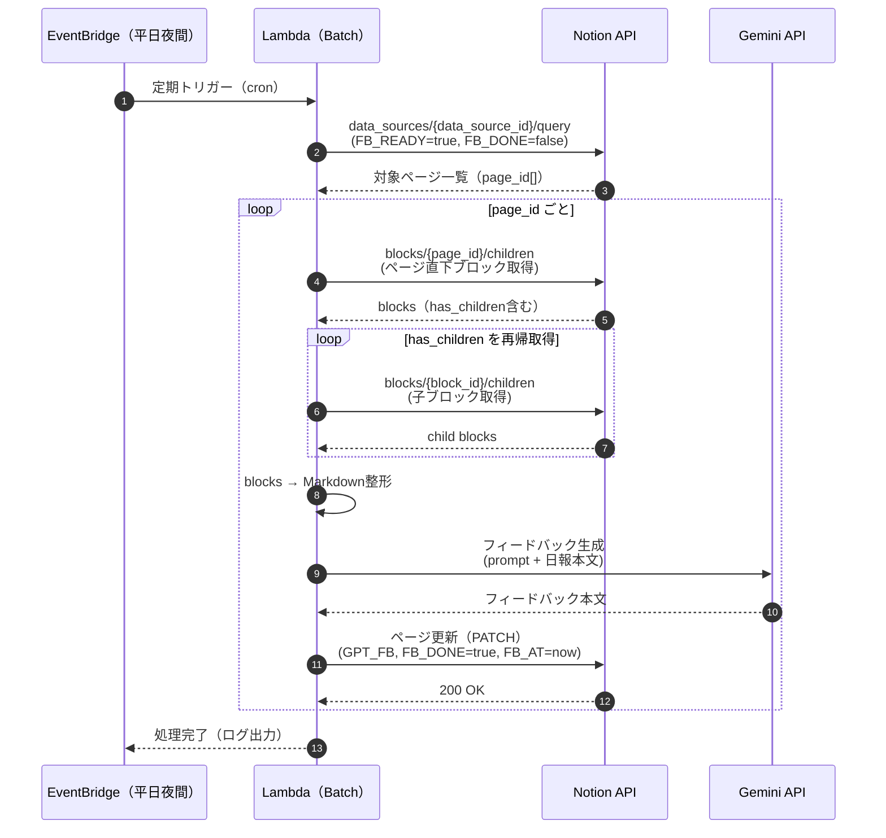

# Processing Flow（簡易シーケンス）

本ドキュメントでは、  
日報フィードバック自動化バッチの **処理順序と責務分担** を  
簡易シーケンス図として示します。

---

## 処理概要

- 平日夜間に EventBridge からバッチが起動
- Notion から「未処理の日報」を取得
- 日報本文（blocks）を再帰的に取得・整形
- AI（Gemini）にフィードバック生成を依頼
- 結果を Notion に書き戻し、状態を更新

---

## シーケンス図

